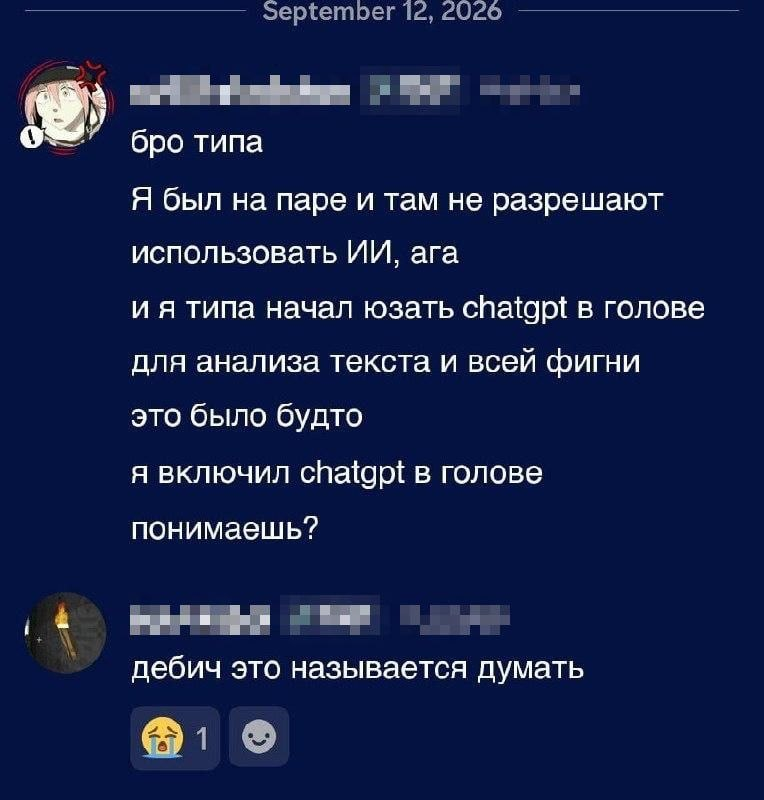

# Лабораторная работа №1

## Обо мне
- **ФИО:** Бойко Виктория Владимировна
- **Группа:** 6405-010302D
- **Научный руководитель:** Козлова Елена Сергеевна
- **Предполагаемая тема диплома:** Использование нейронных сетей для моделирования фокусировки излучения

## Цитата
> «Видишь, голубчик, я откровенно и просто скажу: всякий порядочный человек должен быть под башмаком хоть у какой-нибудь женщины.»  

– Ф.М. Достоевский

## Картинка

## Бонус: анекдот
Пригласили ветеринара, статистика и физика, чтобы каждый за 100 тысяч долларов в течение недели придумал способ для угадывания коня, который победит на скачках. Через неделю все трое приходят...

Ветеринар: Я разработал таблицу, по которой, зная физические данные коней, можно будет предсказать победителя.

Статистик: Я построил регрессию, по которой, зная предыдущие забеги, можно предсказать коня-победителя.

Физик: Мне нужно для работы ещё два года и 1 миллион долларов, но к настоящему моменту я построил модель сферического коня в вакууме.